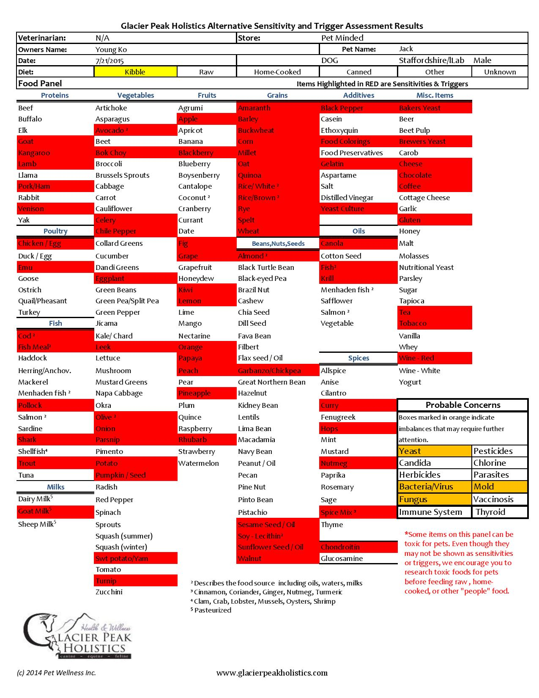
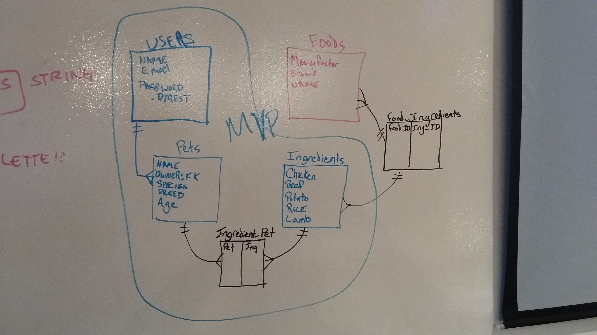
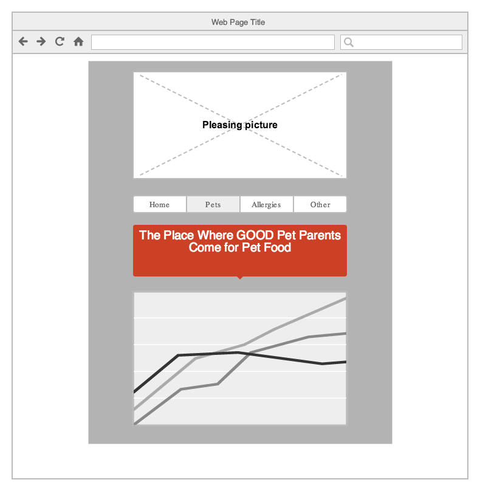
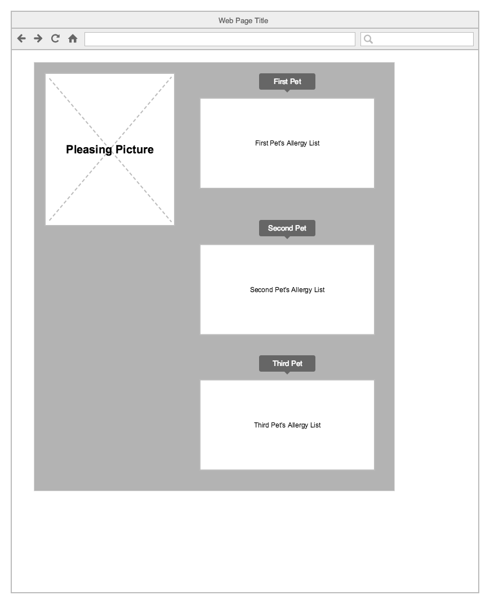

MVP:
A DB to store allergy ingredients for owners.

Expanded Idea:
Searchable Pet Food Ingredients DB. 

Purpose:
Assist pet owners via storing pet allergies and cross referencing food ingredients to find quality foods that avoid their pet's allergies.

Bonus: Can be expanded to treats.

Typical allergy chart:

ERD:

User- They have a log in and can have several pets.

Pets - Lacking opposable thumbs, the pet will have one user. Each pet can have many ingredients they are allergic to.

Ingredients - A table filled with ingredients

Landing Page:

Pet Allergy Page:

